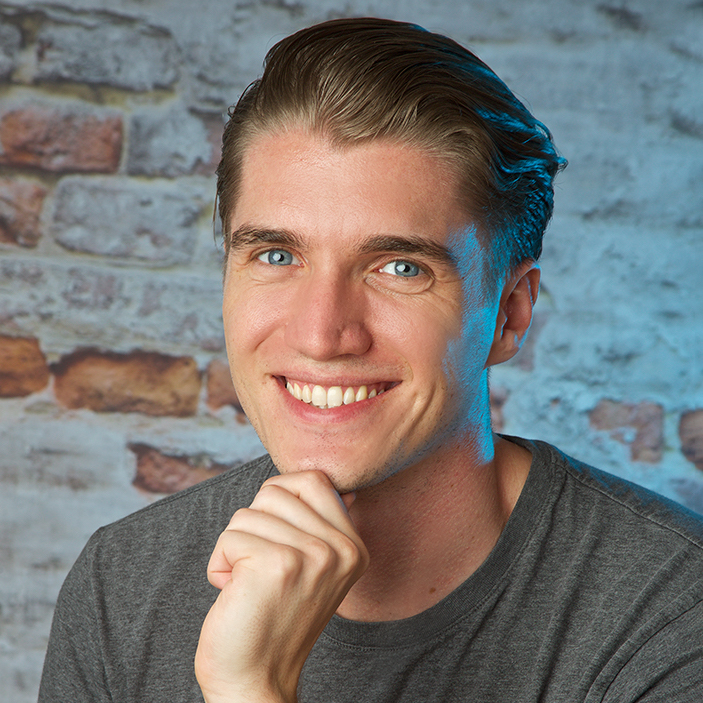

# speaking
Upcoming and past speaking engagements of [@KrauseFx](https://twitter.com/KrauseFx)

Feel free to submit PRs to add new events to the list, or drop me an email at speaking@krausefx.com.

 
&nbsp;&nbsp;&nbsp;&nbsp;&nbsp;&nbsp;&nbsp;&nbsp;&nbsp;&nbsp; **[Square](assets/FelixKrauseProfileSquare.jpg)** | **[Full](assets/FelixKrauseProfileFull.jpg)**

## Bio

> Felix is the creator of fastlane, an open source toolset for automating all your iOS and Android development tasks. He joined Twitter in 2015, and recently started working at Google, where he now works full-time on open source tooling for mobile app developers. Before that Felix worked at various startups in Europe and in the U.S. where he collected over 6 years of experience in the iOS ecosystem.

## Video recordings of previous talks

- [Scaling Open Source Communities, 2017](https://www.youtube.com/watch?v=DiVQXn56MiM)
- [Getting started with open source, 2017](https://vimeo.com/235309173)
- [Building and shipping your first fastlane plugin, 2017](https://youtu.be/scfOk5SgrKU?t=17m42s)
- [Automate your releases using fastlane, 2016](https://www.youtube.com/watch?v=wOtANfkh2bI)

### 2018

Location | Date | Conference
---------|------|------------
New York, USA | 22nd February | [Moving Forward](https://www.moving-forward.com/nyc/)
TBA | 20th, 21st April | TBA
Vienna, Austria | 16th - 18th May | [WeAreDevelopers Congres](https://www.wearedevelopers.com/congress/)

### 2017

Location | Date | Conference
---------|------|------------
Melbourne, Australia | 23rd - 24th February | [PlaygroundsCon](http://www.playgroundscon.com/)
Tokyo, Japan | 3rd March | [try! Swift](https://www.tryswift.co/tokyo/en)
Lausanne, Switzerland | 24th April | [App Builders](https://www.appbuilders.ch/)
Budapest, Hungary | 25th - 28th April | [Craft Conf](https://craft-conf.com/)
Vienna, Austria | 11th - 12th May | [WeAreDevelopers](http://www.wearedevelopers.org/)
Logroño, Spain | 13th - 15th September | [NSSpain](https://2017.nsspain.com/)
Paris, France | 22nd - 23rd September | [FrenchKit](http://frenchkit.fr/)
Verona, Italy | 11th - 13th October | [PragmaConf](https://pragmaconference.com/)
Amsterdam, Netherlands | 31st October | [Firebase Dev Summit](https://firebase.google.com/dev-summit-17/?utm_source=Social&utm_medium=KrauseFx&utm_campaign=KrauseFx)
